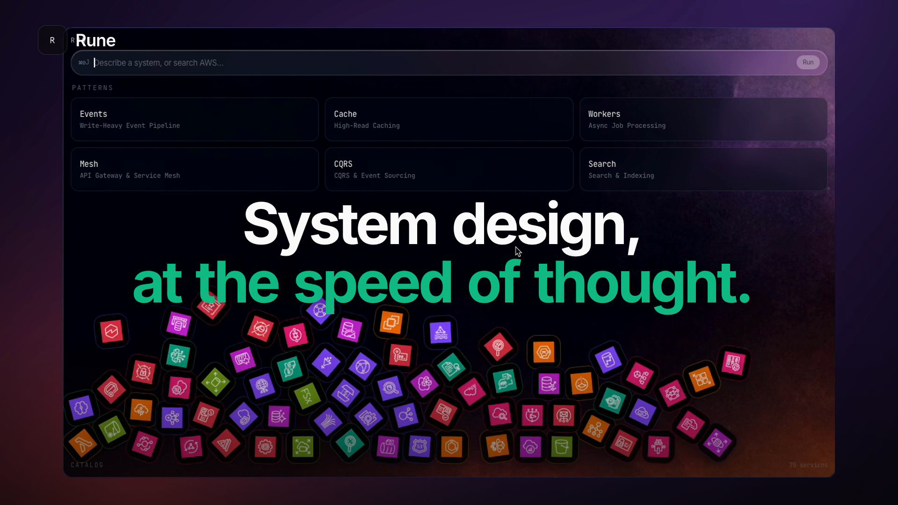

# Rune

Talk to a live AWS architecture diagram.

Rune is a frameless native HUD (`⌘⇧J` to show, `Esc` to hide). Type what you are building. Jev classifies the graph, hangs official AWS architecture icons onto the right path, and follow-up prompts edit the diagram you already have — cache, replicas, queues, workers — without wiping the board.

## Demo

[](docs/rune-demo.mp4)

<video src="docs/rune-demo.mp4" poster="docs/rune-poster.png" width="100%" controls muted playsinline></video>

## Run

```bash
npm install
npm run desktop
```

Vite-only: `npm run dev` → http://127.0.0.1:1420

Put `VITE_TYPESAFE_API_KEY` in `.env` so compiles can call Jev. The HUD will not invent a full design without it.

## How it works

1. **Describe** — `e-commerce checkout with auth, orders, and payments`
2. **Modify** — click a node, then `too slow, speed up the order path` (Redis + read replicas on that path)
3. **Extend** — `attach a job queue and async workers to the order service so confirmation emails don't block checkout`

The catalog pile is real Matter physics. Search lifts matching AWS services; click a tile to drop it onto the canvas. You can also add, connect, group, and recolor by name.

## Stack

Tauri v2, React, TypeScript, Dagre, Matter.js, official AWS architecture icons, Jev (`@typesafe-ai/sdk`) via a Tauri proxy.
